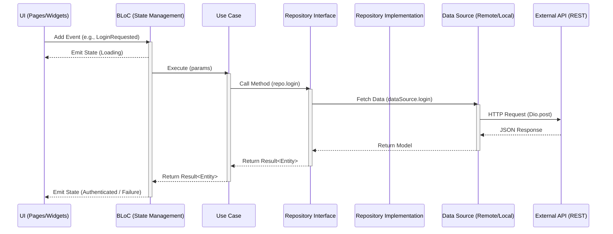

## Folder Structure

The project follows a **Feature-First Clean Architecture** approach, ensuring separation of concerns and scalability.

```
lib/
├── core/                # Global infrastructure (Independent of features)
│   ├── di/              # Main Service Locator (GetIt)
│   ├── error/           # Standardized Failures
│   ├── network/         # Centralized Dio Client & Network Logic
│   └── result/          # Freezed-based Result pattern (Success/Failure)
├── features/            # Feature modules (Domain-specific logic)
│   └── auth/            # Example: Auth Feature
│       ├── data/        # Data Layer (Infrastructure)
│       │   ├── datasources/  # API calls
│       │   ├── models/       # DTOs (Freezed + JSON Serializer)
│       │   └── repositories/ # Repository Implementations
│       ├── domain/      # Domain Layer (Pure Business Logic)
│       │   ├── entities/     # Pure Data Classes
│       │   ├── repositories/ # Repository Interfaces
│       │   └── usecases/     # Single-responsibility business actions
│       ├── presentation/# Presentation Layer (UI & State)
│       │   ├── bloc/         # Feature BLoC (Freezed states/events)
│       │   ├── pages/        # Feature Screens
│       │   ├── routes/       # Feature-specific Route Paths
│       │   └── widgets/      # Feature-specific UI Components
│       └── auth_di.dart # Feature-specific DI registration
├── app/                 # Global App Config & Shared Components
│   ├── core/            # App-level config
│   │   └── config/      # Routes (GoRouter) and Theme Logic
│   └── shared/          # Reusable UI & Logic across features
│       └── widgets/     # Atomic Design (Atoms, Molecules, Organisms)
└── main.dart            # Application Entry Point
```

## Architectural Layers

### 1. Domain Layer (Highest Level)
- **Entities**: Pure Dart objects representing business data. No dependencies on JSON or external libraries.
- **Repository Interfaces**: Abstract contracts defining data operations required by the business.
- **Use Cases**: Single business actions (e.g., `LoginUseCase`). They only depend on repository interfaces and return `Result<T>`.

### 2. Data Layer
- **Models (DTOs)**: Freezed classes used for JSON serialization. Includes mappers (`toEntity()`) to convert DTOs to Domain Entities.
- **Data Sources**: Handle raw data operations (e.g., calling Dio for REST APIs).
- **Repositories**: Implementations of the Domain repository interfaces. They orchestrate data flow between sources and map data to entities.

### 3. Presentation Layer
- **BLoC**: Manages feature state using Freezed union types for Events and States. BLoCs only interact with Use Cases.
- **Pages**: UI screens that consume BLoC states and render the final interface.
- **Routes**: Feature-specific route definitions and path constants are encapsulated here to maintain modularity.
- **Feature DI**: Each feature contains its own DI registration (e.g., `auth_di.dart`) to register its own BLoCs, UseCases, and Repositories into the global service locator.
- **Atomic Design**: Shared and feature-specific widgets follow the Atomic Design pattern, organized into `Atoms`, `Molecules`, and `Organisms`.

### 4. Core & App Layers
- **Core**: Contains infrastructure code that is agnostic to any specific business feature (e.g., how we handle network requests or DI).
- **App**: Handles app-level configuration like navigation and global themes, as well as shared components used by multiple features.

## Architecture Flow

The following diagram illustrates how data and events flow through the layers during a typical action:



### Layer Responsibilities

| Layer | Responsibility |
| :--- | :--- |
| **Presentation** | Captures input, triggers events, and renders state. |
| **BLoC** | Orchestrates state transitions. It knows **what** to do but not **how**. |
| **Domain (UC)** | Encapsulates a single business rule. |
| **Data (Repo)** | The single source of truth. Orchestrates data sources. |
| **Data (DS)** | Direct communication with APIs or Databases. |

---

## Technical Features

### 1. Standardized Error Handling
The project uses a unified `Result<T>` pattern for all asynchronous operations.
- **Failures**: Standardized classes (e.g., `ServerFailure`, `NetworkFailure`, `ValidationFailure`) located in `lib/core/error/`.
- **Global Error Reporting**: Uncaught errors and crashes are automatically reported to **Firebase Crashlytics** via the `main.dart` global error handlers.

### 2. Network & API Integration
- **DioClient**: A centralized HTTP client with pre-configured timeouts and response types.
- **Interceptors**: 
  - `DioAuthInterceptor`: Manages headers and authentication.
  - `JwtInterceptor`: Handles automatic token refresh logic and session expiration detection.
  - `LogInterceptor`: Comprehensive logging for debugging network requests in development.
- **Dio Error Handling**: Centralized `handleDioError` utility converts HTTP errors into domain-specific `Failure` objects.

### 3. Atomic Design System
UI components are organized by complexity to maximize reusability:
- **Atoms**: Basic building blocks (Buttons, Inputs, Spacers).
- **Molecules**: Groups of atoms functioning as a unit (Search fields, Product cards).
- **Organisms**: Complex components that form distinct sections of a page (Product grids, Navigation bars).

### 4. Security & Persistence
- **Token Storage**: Encrypted storage for sensitive session tokens using `flutter_secure_storage`.
- **Local Storage**: Key-value persistence using `shared_preferences`.
- **Cache Logic**: Network response caching implemented via `dio_cache_interceptor` with a Hive-based store for performance.

## Dependency Injection (GetIt)

We use a modular DI approach:
1. Feature-specific registrations happen in `feature_name_di.dart`.
2. These are aggregated in `lib/core/di/service_locator.dart`.
3. The main entry point calls `sl.init()` before the app starts.

## Code Generation

This project uses `freezed` and `json_serializable` for data modeling and BLoC state management.

### Commands
All common tasks (generation, watching, environment setup) are managed via the `makefile`. See the **Scripts & Automation** section below for a full list of commands.

## Key Packages
- `flutter_bloc`: State management.
- `freezed`: Immutable models and union types.
- `get_it`: Dependency injection.
- `dio`: HTTP client.
- `go_router`: Navigation.
- `flutter_localizations`: Native multi-language support (intl).
- `mocktail` & `bloc_test`: Industry-standard testing tools.
- `makefile`: Task runner for common project operations.

## Scripts & Automation

The project includes a suite of automation scripts (located in `scripts/`) and a `makefile` to streamline development tasks.

### Makefile Commands

| Command | Description |
| :--- | :--- |
| `make project-setup` | Full project initialization (Clean + Pub Get + Git Hooks). |
| `make set-env-dev` | Configure environment for Development. |
| `make set-env-prod` | Configure environment for Production. |
| `make generate` | Run `build_runner` for one-time code generation. |
| `make watch` | Run `build_runner` in watch mode. |
| `make flutter-clean` | Clean build artifacts and fetch dependencies. |
| `make flutter-fix` | Run dart formatter and apply automated fixes. |
| `make swagger-gen` | Generate feature code from Swagger (requires `TAG` and `FILE`). |
| `make setup-firebase` | Automated Firebase configuration helper. |
| `make generate_dynamic_links` | Configure Android/iOS deep linking and dynamic links. |

### Helper Scripts (`scripts/`)
- `configure_links.sh`: Configures deep linking and generates site association files.
- `generate_keystore.sh`: Automates Android keystore generation and properties setup.
- `patch_gradle.sh`: Applies necessary patches to Android's `build.gradle` for production.
- `set_env.sh`: Manages `.env` file switching across environments.
- `setup_firebase.sh`: Streamlines Firebase CLI integration.
- `setup_hooks.sh`: Installs project-specific Git hooks.

---

## Testing

For detailed instructions on our testing strategy, including templates for Unit, Widget, and Integration tests, please see [TESTING.md](TESTING.md).

### Quick Commands
- **Run All Tests**: `flutter test`
- **Unit Tests**: `flutter test test/unit`
- **Widget Tests**: `flutter test test/widget`
