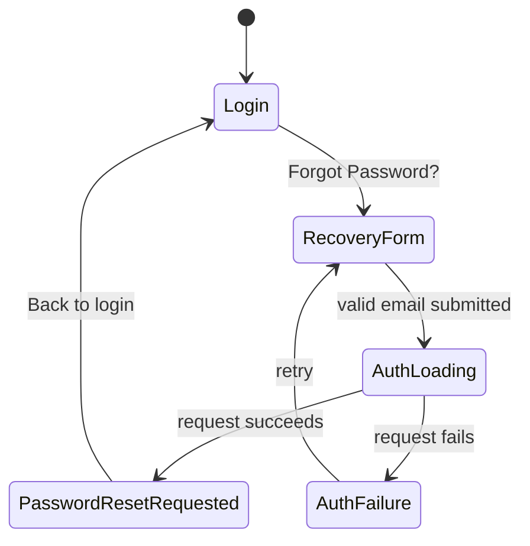

# Auth Feature Spec

## Purpose and scope

The auth feature provides login, session restoration, logout, and password-recovery requests. Login uses username and password; password recovery uses the account email address. Registration screens and events exist, but `AuthRepositoryImpl.signUp` is not implemented yet.

## Domain contracts and entities

- `UserEntity` contains the signed-in user's profile information and optional access/refresh tokens.
- `TokenEntity` carries optional access and refresh tokens for session restoration and refresh.
- `AuthRepository` exposes `ApiResult` contracts for login, forgot password, signup, token refresh, current-session lookup, and logout.
- `ForgotPasswordUseCase.call(email)` delegates password-recovery requests to the repository and returns `Future<ApiResult<String>>`.
- Password recovery introduces no new domain entity; its success string is the confirmation shown to the user.

## User flows

### Login

1. The user enters a username and password on `/login`.
2. The form validates required values and dispatches `AuthEvent.loginRequested` with the form values.
3. `AuthBloc` calls `LoginUseCase`, which delegates to `AuthRepository.login`.
4. On success, the repository maps `UserModel` to `UserEntity` and stores returned tokens. The BLoC emits `Authenticated`.
5. On failure, the BLoC emits `AuthFailure`; the login page displays the failure message.

### Password recovery

1. The user selects **Forgot Password?** on `/login` and navigates to `/forgot-password`.
2. The user enters a valid email address. The page trims the address and dispatches `AuthEvent.forgotPasswordRequested`.
3. `AuthBloc` emits `AuthLoading` and calls `ForgotPasswordUseCase`.
4. The remote data source sends the email to the recovery endpoint. The repository maps request errors to `ServerFailure` and returns `ApiResult.failure`.
5. On any successful HTTP response, the repository returns the generic confirmation: “If an account exists for this email, a password reset link will be sent.” The page displays it and offers a route back to `/login`.

### Session restoration and logout

- On BLoC creation, `AppStarted` checks secure storage through `SessionUseCase`. Stored tokens produce `Authenticated`; missing tokens produce `Unauthenticated`.
- Logout clears stored tokens through `LogoutUseCase`, then emits `Unauthenticated` on success.
- Token refresh uses `/auth/refresh` and the `refreshToken` request field.

## API contract

| Operation | Method and path | Request body | Client behavior |
| --- | --- | --- | --- |
| Login | `POST /auth/login` | `{"username":"…","password":"…","expiresInMins":1}` | Parses a `UserModel`, maps it to `UserEntity`, and stores returned tokens. |
| Forgot password | `POST /auth/forgot-password` | `{"email":"person@example.com"}` | Ignores the successful response body and displays a generic confirmation. |
| Refresh token | `POST /auth/refresh` | `{"refreshToken":"…"}` | Reads access and refresh tokens from the response. |

The reset endpoint is represented by `ApiEndpoints.forgotPassword`. The request body is the agreed client contract; the repository Swagger file does not currently define this endpoint. No specific reset response schema is assumed. A successful request does not authenticate the user or change local tokens. The generic confirmation avoids revealing whether the email is registered.

## Routing and access

- Auth routes are `/login`, `/register`, and `/forgot-password`.
- All three are public routes; unauthenticated users can enter password recovery without being redirected away.
- Authenticated users are redirected from `/login` to the product route. Password recovery itself does not change authentication state.

## Current implementation references

- Domain: `lib/features/auth/domain/entities/`, `domain/repositories/auth_repository.dart`, `domain/usecases/`
- Data: `lib/features/auth/data/datasources/`, `data/models/user_model.dart`, `data/repositories/auth_repository_impl.dart`
- Presentation: `lib/features/auth/presentation/state_management/auth_bloc.dart`, `presentation/pages/forgot_password_page.dart`, `presentation/widgets/molecules/login_page_view.dart`
- Routing and DI: `lib/features/auth/presentation/routes/`, `lib/features/auth/auth_di.dart`, `lib/core/routes/app_route_redirect.dart`
- Widget coverage: `test/widget/features/auth/presentation/forgot_password_page_test.dart`, `login_page_view_test.dart`

## Boundaries and limitations

- The server owns reset-token generation, email delivery, expiration, and the eventual password update. This client flow only requests delivery of a reset link.
- Signup is not currently operational: `AuthRepositoryImpl.signUp` throws `UnimplementedError`.
- The repo Swagger file does not document `/auth/forgot-password`; coordinate contract changes with the backend before changing the client request shape.
